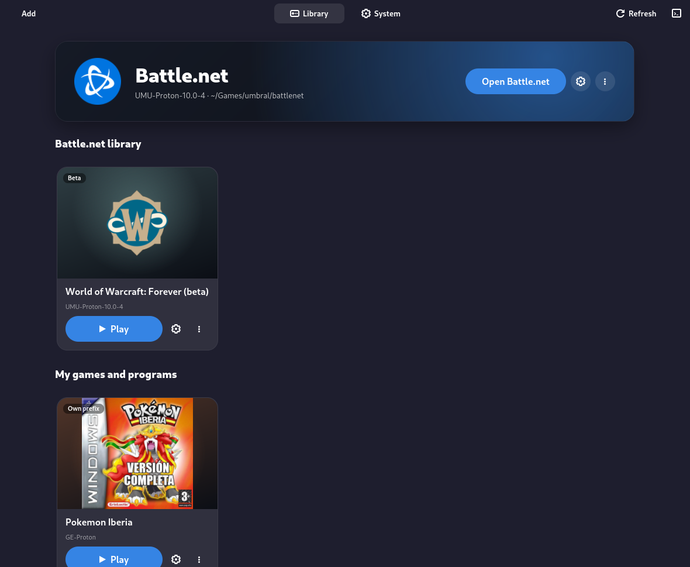
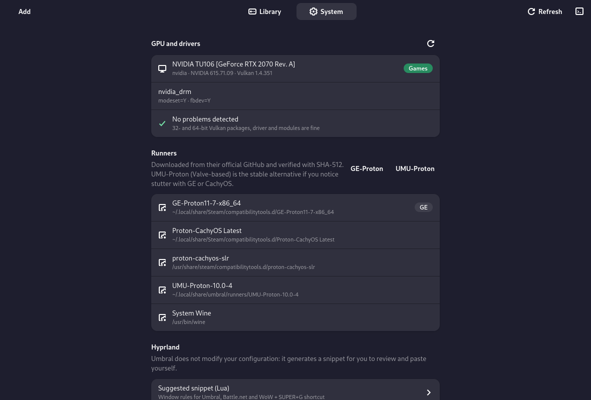
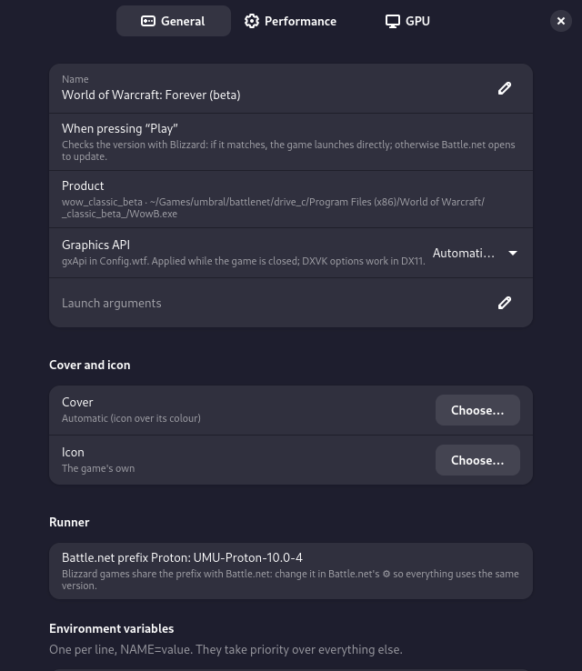
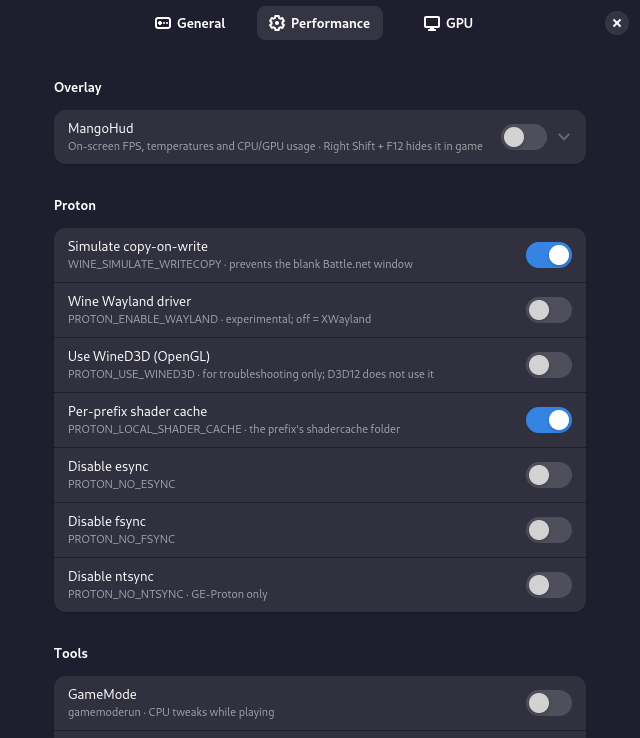
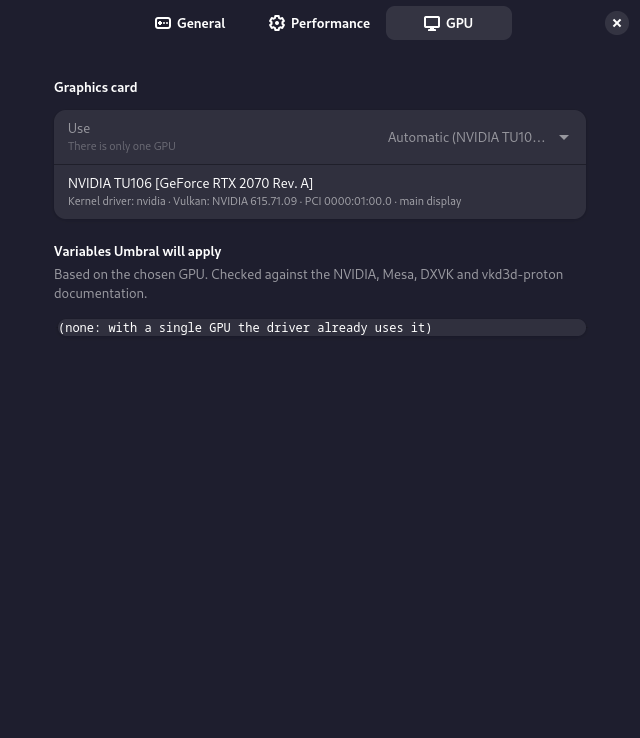
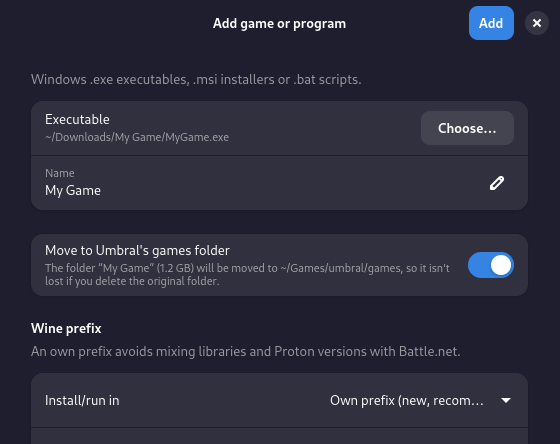
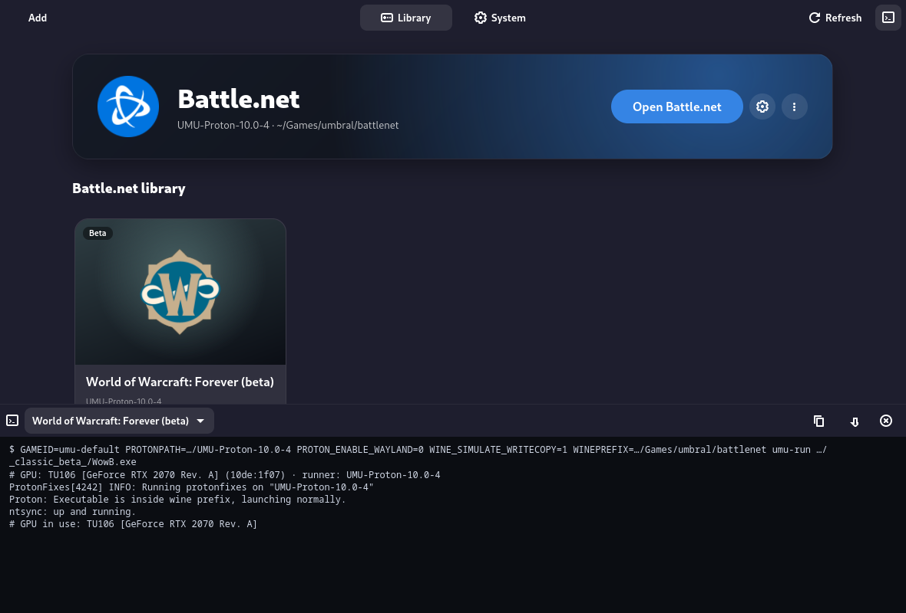
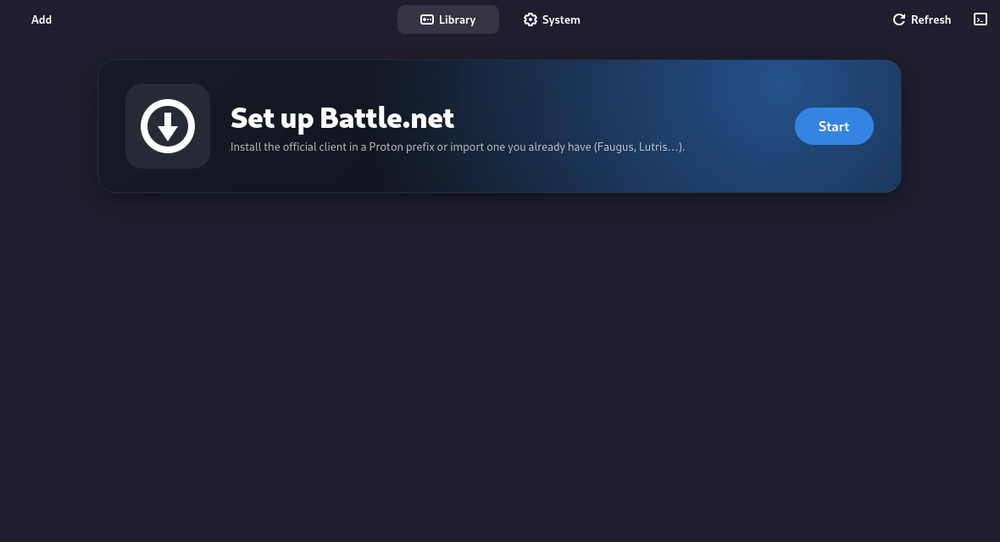
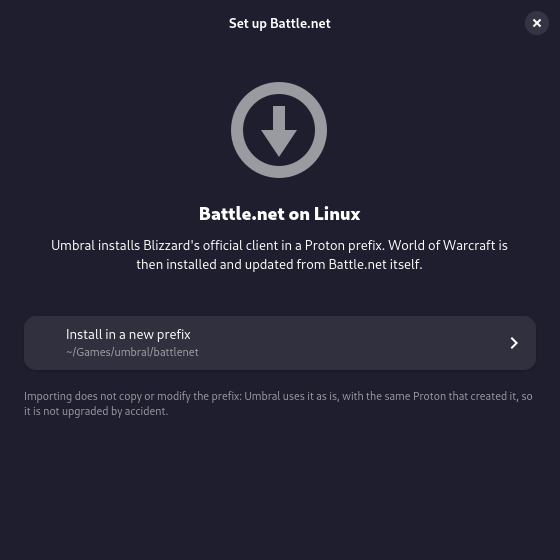
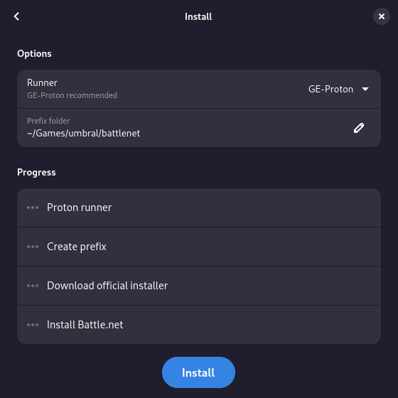

<p align="center"></p>

# 閾 Umbral

[](https://github.com/madkyp/umbral-project/actions/workflows/tests.yml)


**A minimal Battle.net launcher for Arch / CachyOS + Hyprland**, built with GTK4 / libadwaita and running games through [umu-launcher](https://github.com/Open-Wine-Components/umu-launcher) + Proton.

Umbral installs the **official Battle.net client** in its own Proton prefix (or imports the one you already have from Faugus, Lutris…), detects the games you install from it — **World of Warcraft: Forever** first — and launches them with one click, checking for updates first without even opening Battle.net. It can also run any other Windows `.exe`, `.msi` or `.bat` in its own prefix.

> *Umbral* is Spanish for *threshold*: the doorway between your Linux desktop and your Windows games.

> ⚠️ **Alpha version.** Umbral works end to end on the author's machine (CachyOS + Hyprland + NVIDIA), but it is young software: expect rough edges and please report what breaks.

> 🤖 **This project was built with the help of AI.** See the [disclaimer](#-disclaimer) below.

---

## ✨ Features

### 🎮 Battle.net, set up for you
- **Guided installer**: creates a Proton prefix, downloads the **official** installer from `battle.net` (HTTPS origin, size and PE header checked) and runs it. Battle.net then installs and updates your games — Umbral never downloads games itself.
- **Import an existing prefix** (e.g. `~/Faugus/battlenet`) without copying or modifying it, keeping the **same Proton that created it** so it isn't upgraded by accident.
- Ships with the environment that makes Battle.net work today: `WINE_SIMULATE_WRITECOPY=1` (no more blank window) and XWayland.
- **Repair menu**: clear the client cache, reset the Agent (*"went to sleep"* error), re-run the installer, optional `winetricks` dependencies, `wineserver -k`, recreate the prefix **keeping your games**, restore a prefix backup.

### ▶️ One-click Play, with an update check
When you press **Play** on a Blizzard game:

| Situation | What Umbral does |
|---|---|
| Your build matches the one Blizzard publishes | Launches the game **directly** — Battle.net doesn't open and uses no RAM |
| A new version is out | Tells you (*"you have X, Y is available"*) and **opens Battle.net** so it can update |
| The version server can't be reached | Warns you and launches anyway |

The check compares the build in the game's `.build.info` with Blizzard's official version server (`https://<region>.version.battle.net/v2/products/<product>/versions`). In direct mode you sign in on the game's own login screen.

### 📚 Two libraries
- **Battle.net library** — games installed from Battle.net appear by themselves (read from Battle.net's `product.db`, with a folder-scan fallback) and disappear when they are uninstalled or the prefix is deleted.
- **My games and programs** — anything you add with **Add**:
  - `.exe` files, `.msi` installers (run through `msiexec`) and `.bat` scripts (through `cmd`).
  - Each one in its **own prefix** (recommended) or in the Battle.net one.
  - After running an **installer**, Umbral lists the new executables it left behind and adds the game with one click.
  - **Moves the game into Umbral's games folder** (`~/Games/umbral/games/`, on by default) so it doesn't live in *Downloads* waiting to be deleted by accident. Only the game's own folder moves — a loose `.exe` in *Downloads* moves alone, `bin/` or `Binaries/Win64/` layouts move from the game's root, and installers are never moved. Already-added games can be moved from their ⋮ menu, and removing a game offers to delete its files too (never without asking).
- **Every card has the same size**, Battle.net games and your own alike:
  - by default the **game's own icon** (extracted from the `.exe`) sits in the logo slot over its dominant colour;
  - a **cover image** you pick is shown **whole, edge to edge** — no cropping or zoom, the spare space takes the image's colour;
  - a custom **icon** is fitted into the logo slot keeping its transparency.
- **[SteamGridDB](https://www.steamgriddb.com/) covers**: games you add get a cover automatically, and a gallery in each game's settings lets you pick community covers or logos. Needs your free API key (*System → SteamGridDB*), stored only on your machine.
- **Playtime**: total hours and last session on every card (*"3 h 20 min · today"*), saved every minute — also when WoW is started through Battle.net.

### 🖥️ GPU aware — NVIDIA, AMD and hybrids
- Detects every GPU (`lspci`, `vulkaninfo`), its driver and Vulkan support, and flags problems with the **exact `pacman` command** to fix them: missing `lib32` Vulkan packages, `nouveau`, `nvidia_drm.modeset` off, old drivers for vkd3d-proton, AMDVLK next to RADV…
- Per-game **GPU selection** on multi-GPU systems: PRIME render offload on NVIDIA, `DRI_PRIME` / `MESA_VK_DEVICE_SELECT` on Mesa, plus `DXVK_FILTER_DEVICE_NAME` / `VKD3D_FILTER_DEVICE_NAME` — every variable checked against the official NVIDIA, Mesa, DXVK and vkd3d-proton docs.
- Reports which GPU a running game **actually** opened.

### ⚙️ Per-game settings
- **Runner**: GE-Proton, UMU-Proton, Proton-CachyOS or system Wine. GE-Proton and UMU-Proton download from their official GitHub releases, **verified with SHA-512**.
- **Automatic prefix backup** before a prefix switches Proton version (no games inside, ~300 MB, restorable from *Repair*).
- **Graphics API** for WoW: automatic, DirectX 12 (VKD3D-Proton) or DirectX 11 (DXVK), written to `Config.wtf`.
- **WoW configuration backups** (`WTF`: settings, macros, bars and addon data): automatic when the game closes (at most every 12 h, last 10 kept), on demand from the card menu, and restorable — the current configuration is always saved first.
- **FPS limit** per game (30…240 or your monitor's refresh rate): MangoHud's limiter — works for DXVK and VKD3D even with the overlay hidden — or gamescope's when scaling is on.
- **Resolution and scaling with gamescope**: pick the game's resolution (e.g. 640×480 for RPG Maker games), fullscreen / borderless / window, fit / integer / stretch scaling and a sharp filter for pixel art — the output resolution is read from your monitor.
- **MangoHud** overlay (FPS only / basic / full, any corner), GameMode, esync/fsync/ntsync, WineD3D, Wayland driver, per-prefix shader cache, launch arguments and environment variables.

### 🪟 Desktop integration
- **Tray icon** (StatusNotifierItem — Waybar, KDE…): closing the window keeps Umbral in the background; the menu opens Battle.net or any game. When a game starts, Umbral **hides itself in the tray** (optional; Hyprland has no "minimise").
- Optional **floating window** on Hyprland (runtime rule, your config is never touched) and a validated **Hyprland snippet** (`Hyprland --verify-config`) with window rules and a keybind.
- `.desktop` shortcuts per game, desktop notifications, a collapsible **log console** and per-launch log files.
- **[Control Deck](https://github.com/madkyp/control-deck) integration** (optional): when it is installed, Umbral asks it before each launch (`control-deck hook umbral:<id>`) and adds what you set there for that game: **visual shaders** (ReShade or vkBasalt), the **TEMPS** in-game temperature line and the **CPU scheduler while playing**. Umbral's own options and your environment variables still win.
- **English and Spanish** (follows the system language, switchable in *System → Appearance*).

---

## 📸 Screenshots

| LIBRARY | SYSTEM |
|---|---|
|  |  |

| GAME SETTINGS · GENERAL | GAME SETTINGS · PERFORMANCE | GAME SETTINGS · GPU |
|---|---|---|
|  |  |  |

| ADD A GAME | LOG CONSOLE |
|---|---|
|  |  |

| FIRST RUN | SETUP WIZARD | INSTALL |
|---|---|---|
|  |  |  |

---

## 🧩 Requirements

**Required:**
- `python` (3.11+), `python-gobject`, `python-pillow`, `gtk4`, `libadwaita` (1.5+)
- [`umu-launcher`](https://github.com/Open-Wine-Components/umu-launcher)
- `vulkan-icd-loader`, `lib32-vulkan-icd-loader` and your GPU's Vulkan driver:
  - **NVIDIA**: `nvidia-utils`, `lib32-nvidia-utils`
  - **AMD**: `vulkan-radeon`, `lib32-vulkan-radeon`, `lib32-mesa`
  - **Intel**: `vulkan-intel`, `lib32-vulkan-intel`
- `pciutils`, `vulkan-tools`, `libnotify`, `tar` + `zstd`

**Optional:**
- `mangohud` + `lib32-mangohud`, `gamemode` + `lib32-gamemode`, `gamescope`
- `winetricks` — optional prefix dependencies
- `hyprland` — floating window rule and snippet validation
- A StatusNotifierItem tray (Waybar, KDE…) — to keep Umbral in the background

A Proton build is needed to run games: Umbral detects the ones you already have (Steam's `compatibilitytools.d`, umu) and can download GE-Proton or UMU-Proton for you.

---

## 🚀 Installation

```bash
git clone https://github.com/madkyp/umbral-project.git
cd umbral-project
makepkg -si
```

This builds and installs the `umbral` package (`/usr/bin/umbral`, the `.desktop` launcher and the icon).

Try it without installing:

```bash
cd umbral-project
python -m umbral
```

### Update
```bash
cd umbral-project
git pull
makepkg -sif
```

> Quit Umbral from its tray icon first (closing the window only hides it).

### Uninstall
```bash
sudo pacman -Rns umbral
```
Your prefixes (`~/Games/umbral/`) and settings (`~/.config/umbral/`) are left untouched.

---

## 🖱️ Usage

- From your app launcher: **"Umbral"**.
- **First run**: *Start* → install Battle.net in a new prefix (GE-Proton, `~/Games/umbral/battlenet`) or import an existing one. Sign in to Battle.net and install **World of Warcraft: Forever** from its version selector — its card shows up by itself.
- From a terminal:

| Command | What it does |
|---|---|
| `umbral` | Opens the window (or brings back the running instance) |
| `umbral --launch battlenet` | Opens Battle.net |
| `umbral --launch battlenet:wow_classic_beta` | Plays WoW Forever (beta) — with the update check |
| `umbral --check` | Terminal diagnostics: GPU, packages, runners, prefix, detected games |
| `umbral --running` | Running games as JSON (see [Integration](#-integration)) |
| `umbral --stop <id>` | Closes a running game without opening the window (game first, `wineserver -k` only if it doesn't respond) |
| `umbral --debug` | Detailed logs, including GPU info and every environment variable applied (`PROTON_LOG`, `UMU_LOG`) |

- **F5** refreshes the library, **Ctrl+L** opens or closes the log console (**Esc** closes it).

### Hyprland (optional)
*System → Hyprland → Suggested snippet* generates Lua rules (Hyprland Lua config) for Umbral, Battle.net and WoW plus a `SUPER + G` keybind. It is validated with `Hyprland --verify-config` but **never written to your config** — copy it yourself. A copy lives in [`hyprland-snippet.lua`](hyprland-snippet.lua).

---

## 🔌 Integration

Other apps (e.g. [Control Deck](https://github.com/madkyp/control-deck)) can follow and control Umbral's games:

- **`$XDG_RUNTIME_DIR/umbral/running.json`** — the games running right now, rewritten whenever that changes:

  ```json
  {"version": 1, "umbral_pid": 1234, "updated": 1790000000.0,
   "games": [{"id": "1484d426be", "name": "Pokemon Iberia", "kind": "custom",
              "launched_by": "umbral", "pid": 677724, "pid_starttime": 123456,
              "game_pids": [{"pid": 678020, "starttime": 123500}],
              "exe": "/…/Game.exe", "exe_name": "Game.exe",
              "proton": "GE-Proton11-7-x86_64", "proton_path": "/…",
              "prefix": "/…/Games/umbral/game-2", "started": 1790000000.0}]}
  ```

  `game_pids` are the game's own processes, taken from the process tree Umbral launched — not matched by name, so two different `Game.exe` (RPG Maker) can't be confused. An entry is valid only while its PID exists **and** its `starttime` (field 22 of `/proc/<pid>/stat`) still matches, which rules out reused PIDs. `launched_by` is `battlenet` for games started from the Battle.net client. Games still running when Umbral restarts are kept.
- **`umbral --stop <id>`** — closes a game; the running Umbral does it without showing its window (exit code 0 = closing, 1 = not running). Works even if Umbral is closed, using `running.json`.
- **`control-deck hook umbral:<id>`** — if Control Deck is installed, Umbral asks it for extra launch variables (ReShade / vkBasalt) and lets it follow the session (TEMPS, CPU scheduler) while the game runs.

---

## 🏗️ How it works

**A small Python core + a GTK4 UI**:

| Module | Role |
|---|---|
| `battlenet.py` | Official installer download, client paths, `product.db` protobuf reader, game detection |
| `updates.py` | Compares `.build.info` with Blizzard's version server |
| `launcher.py` | Builds the umu / Proton command and environment, captures logs, clean shutdown (`wineserver -k` → SIGTERM → SIGKILL) |
| `gpu.py` | GPU / driver / Vulkan detection, diagnostics and per-GPU environment |
| `runners.py` / `prefixes.py` | Proton discovery and verified downloads; prefix health, repair, backups |
| `installers.py` | `.msi` / `.bat` handling, "what did this installer install?" and moving games into the games folder |
| `exeicon.py` | Icon extraction from Windows executables (PE resources), thumbnails and card colours |
| `controller.py` | App state and orchestration, independent of the widgets |
| `ui/` · `tray.py` | libadwaita windows and dialogs · StatusNotifierItem + dbusmenu over D-Bus |

Settings live in `~/.config/umbral/config.json`, logs in `~/.local/state/umbral/logs/`, downloaded runners and backups in `~/.local/share/umbral/`, prefixes and moved games in `~/Games/umbral/`.

### Tests

```bash
python -m unittest discover -s tests -t tests
```

The suite runs without GTK, root or network: GPU detection is tested with real and simulated `lspci` / `vulkaninfo` output (NVIDIA, AMD, Intel, Intel+NVIDIA and AMD+AMD hybrids), Battle.net detection with synthetic `product.db` files and fake prefixes, plus the update check, launch environment, backups, installers, moving games out of *Downloads* (without ever moving *Downloads* itself), card thumbnails and translation coverage. GitHub Actions runs it — plus `ruff` — on every push.

---

## 🧪 Compatibility status

| | Status |
|---|---|
| Battle.net install + sign-in (GE-Proton 11, UMU-Proton 10, Proton-CachyOS 11) | ✅ Tested |
| WoW: Forever **beta** (DX12 / VKD3D and DX11 / DXVK) on NVIDIA (RTX 2070, driver 615) | ✅ Tested |
| Direct launch + version check | ✅ Tested |
| WoW: Forever **final release** (Nov 4, 2026) | ⏳ Product ID and folder not known yet — detected generically |
| AMD / Intel / hybrid GPUs | 🧪 Covered by tests with simulated hardware, not on real hardware yet |
| `battlenet://` URIs or `--exec` to start a game from Battle.net | ❌ Don't launch WoW Forever (tested), so they aren't used |

---

## ⚠️ Safety notes

- Umbral **only uses Blizzard's official installer** and never downloads, patches or modifies games. It does not touch anti-cheat or DRM and has no support for private servers.
- It **never runs `sudo`**: fixes that need root are shown as commands for you to copy.
- Your **Hyprland config is never modified**; the floating-window rule is added at runtime only.
- Imported prefixes are never recreated or deleted. Before a prefix changes Proton version it is **backed up** (games excluded), and deleting a game's own prefix always asks first.
- Runner downloads are verified with SHA-512; the Battle.net installer is checked for HTTPS origin, size and PE header (Blizzard doesn't publish hashes).

---

## 🤖 Disclaimer

This project was created **with the help of AI** (Anthropic's Claude, through Claude Code). The code was written together with the AI, then reviewed, tested (see [Tests](#tests)) and used on a real CachyOS + Hyprland system, but:

- It is an **alpha** and is provided **as is**, without warranty of any kind (see the [license](LICENSE)).
- It creates, repairs and — only when you confirm — deletes Wine prefixes. Keep backups of anything important (save games, addons, settings).

Umbral is an independent project, **not affiliated with or endorsed by Blizzard Entertainment**. Battle.net, World of Warcraft and related names are trademarks of Blizzard Entertainment, Inc. Umbral does not ship any Blizzard artwork: game icons are read from your own installed games at runtime (the screenshots show the author's installation).

Found a bug or something that looks wrong? Please open an issue.

---

## 📄 License

MIT — see [LICENSE](LICENSE).
